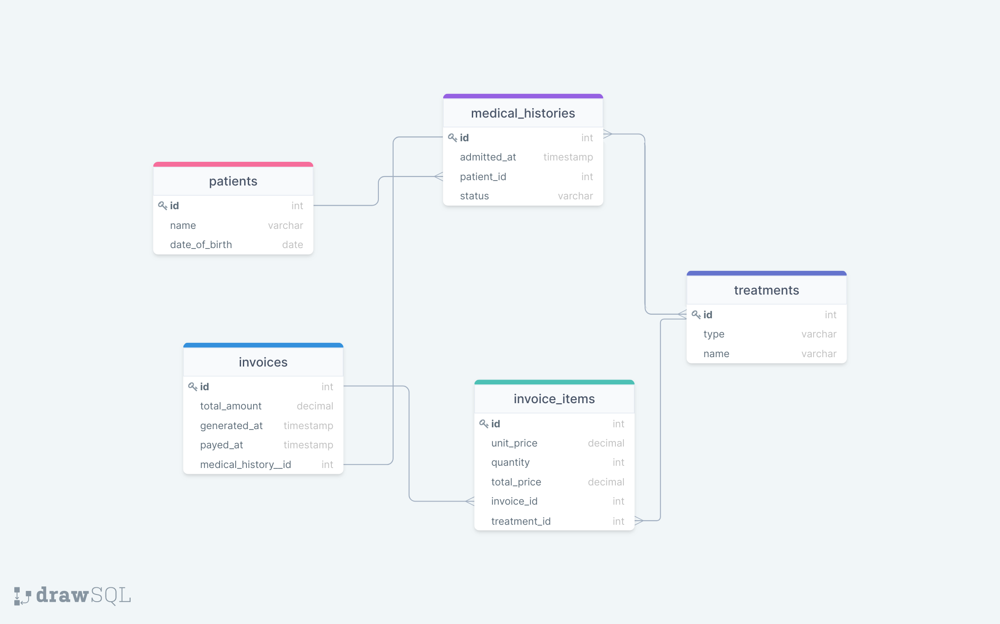

# Database Based on a Diagram

> Database schema based on given ERD diagram

## Getting Started

This repository includes files with plain SQL that can be used to recreate a database:

- Use [schema_based_on_diagram.sql](./schema_based_on_diagram.sql) to create all tables.

## Authors

👤 **Amel Khiri**

- GitHub: [@Algerina](https://github.com/Algerina)
- LinkedIn: [Amel Khiri](https://linkedin.com/in/amel-khiri-qahwadji-37a550135)

👤 **Eapen Zacharias**

- GitHub: [@eapenzacharias](https://github.com/eapenzacharias)
- Twitter: [@eapenzac](https://twitter.com/eapenzac)
- LinkedIn: [LinkedIn](https://linkedin.com/in/eapenzac)

👤 **Piero Lescano**

- GitHub: [@piero-vic](https://github.com/piero-vic)
- Twitter: [@v1ccenzo](https://twitter.com/v1ccenzo)
- LinkedIn: [piero-lescano](https://linkedin.com/in/piero-lescano)

## 🤝 Contributing

Contributions, issues, and feature requests are welcome!

Feel free to check the [issues page](https://github.com/algerina/vet_clinic/issues).

## Show your support

Give a ⭐️ if you like this project!
